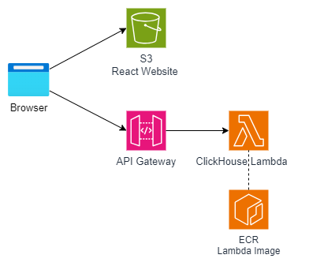

# Experimental ClickHouse Lambda Request Tool

This React application enables users to execute SQL requests on a ClickHouse Database Lambda. The Lambda utilizes the C++ Lambda runtime from [aws-lambda-cpp](https://github.com/awslabs/aws-lambda-cpp) to implement the handler by hooking up Lambda payload as external table data and capturing the query result into a string to send as the Lambda request response. The implementation is available in the [aws_lambda_integration](https://github.com/acoolnev/ClickHouse/tree/aws_lambda_integration) branch.

## Architecture

A browser loads the static website with the React application from an S3 bucket. The application gathers parameters from corresponding UI components, generates a JSON request in ClickHouse Lambda format, and sends it to ClickHouse Lambda via API Gateway.

The application can be accessed via the URL: http://clickhouse-lambda-demo.s3-website.us-east-2.amazonaws.com.
